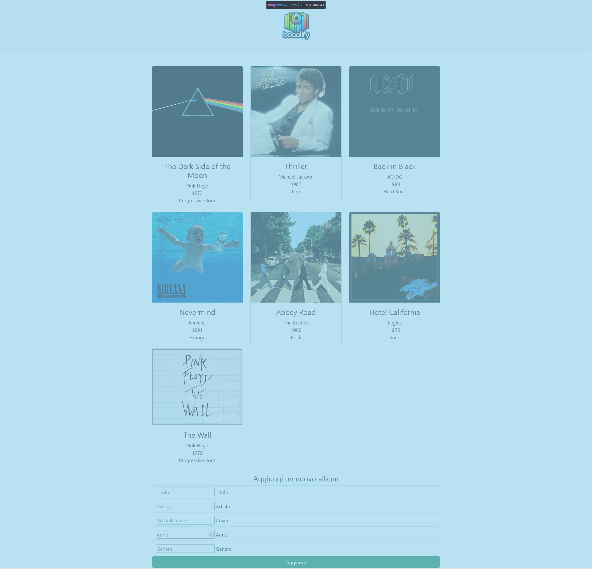

# EX - PHP Dischi

## Descrizione

**Nome repo:** `php-dischi-json`  
Dobbiamo creare una web-app che permetta di leggere una lista di dischi presente nel nostro server.  
I dischi dovranno avere questa struttura:  
- **Titolo**  
- **Artista**  
- **URL della cover**  
- **Anno di pubblicazione**  
- **Genere**  

## Consigli

Nello svolgere l’esercizio seguite un approccio graduale:  
1. Assicuratevi che la vostra pagina `index.php` riesca a comunicare correttamente con il vostro script PHP.  
2. Solo a questo punto sarà utile passare alla lettura della lista da un file JSON.  

## Bonus

Tramite un form, dai la possibilità all’utente di aggiungere un disco all’elenco.

## Screenshot

Ecco uno screenshot d'esempio di come potrebbe risultare l'applicazione finale:  

